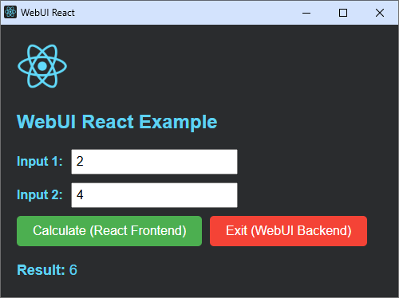

## React WebUI Example

This is a basic example of how to use WebUI with React to generate a portable single executable program. WebUI will run the internal web server and use any installed web browser as GUI to show the React UI.

A simple Python script `vfs.py` is used to generate `vfs.h` to embed the whole react's build folder into the portable single executable program.

### How to use it?

1. Run script `build_react` to re-build the React project and compile the C file

### How to create a React WebUI project from scratch?

1. Run `npx create-react-app my-react-app` to create a React app using NPM
2. Add `` into `public/index.html` to connect UI with the backend
3. Run `python vfs.py "./my-react-app/build" "vfs.h" "index.html"` to embed the build folder
4. Now, use any C compiler to compile `main.c` into a portable executable program

### Other backend languages examples:

- Coming soon...
