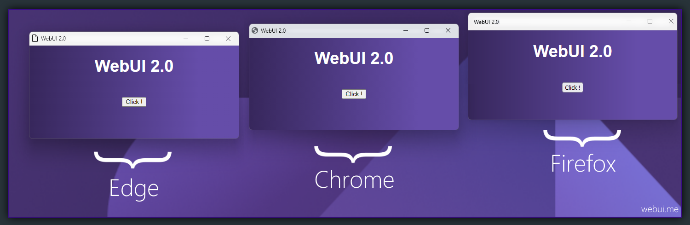
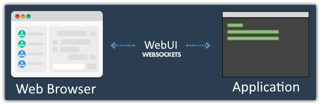

# WebUI v2.3.0 Documentation

> Use any web browser as GUI, with your preferred language in the backend and HTML5 in the frontend, all in a lightweight portable lib.

> :warning: **Notice**:
> 
> * WebUI it's not a web-server solution or a framework, but it's an lightweight portable lib to use any installed web browser as a user interface.

## Features

- Written in Pure C
- Fully Independent (*No need for any third-party runtimes*)
- Lightweight (*~160 Kb using TCC*) & Small memory footprint
- Fast binary communication protocol between WebUI and the browser (*Instead of JSON*)
- One header file
- Multi-platform & Multi-Browser
- Using private profile for safety

## CppCon 2019 Presentation

[Borislav Stanimirov](https://ibob.bg/) discusses using HTML5 in the web browser as GUI at the [C++ Conference 2019 (*YouTube*)](https://www.youtube.com/watch?v=bbbcZd4cuxg).

## UI & The Web Technologies

Web application UI design is not just about how a product looks but how it works. Using web technologies in your UI makes your product modern and professional, And a well-designed web application will help you make a solid first impression on potential customers. Great web application design also assists you in nurturing leads and increasing conversions. In addition, it makes navigating and using your web app easier for your users.

## Why Use Web Browser?

Today's web browsers have everything a modern UI needs. Web browsers are very sophisticated and optimized. Therefore, using it as a GUI will be an excellent choice. While old legacy GUI lib is complex and outdated, a WebView-based app is still an option. However, a WebView needs a huge SDK to build and many dependencies to run, and it can only provide some features like a real web browser. That is why WebUI uses real web browsers to give you full features of comprehensive web technologies while keeping your software lightweight and portable.

## How does it work?

Think of WebUI like a WebView controller, but instead of embedding the WebView controller in your program, which makes the final program big in size, and non-portable as it needs the WebView runtimes. Instead, by using WebUI, you use a tiny static/dynamic library to run any installed web browser and use it as GUI, which makes your program small, fast, and portable. **All it needs is a web browser**.

## Runtime Dependencies Comparison

|  | WebView | Qt | WebUI |
| ------ | ------ | ------ | ------ |
| Runtime Dependencies on Windows | *WebView2* | *QtCore, QtGui, QtWidgets* | ***A Web Browser*** |
| Runtime Dependencies on Linux | *GTK3, WebKitGTK* | *QtCore, QtGui, QtWidgets* | ***A Web Browser*** |
| Runtime Dependencies on macOS | *Cocoa, WebKit* | *QtCore, QtGui, QtWidgets* | ***A Web Browser*** |

### License

> Licensed under MIT License.
