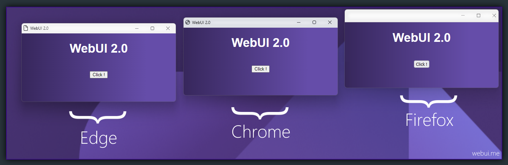

# WebUI

> Bring the power of web browsers with the web technologies into you GUI, using your favorit programming language in the backend, and HTML/JS/CSS in the frontend.

## Why WebUI?

Web technology is everywhere, and the web browsers have everything a modern UI need. While all other "WebView" based GUI libraries can not provide all features like a real web browser provides, WebUI use any installed web browser to give you the full power of a web browser. WebUI is fully written in C, and the final result library is completely independent an does not need any third-party library.

## How its work?

WebUI use a WebSocket communication in binary mode between the web browser (UI) and your application. Your application will receive click events. And of course you can send/receive data or execute JavaScript from your favorit programming language. 

## Features

- Pure C & Independent (*No need for any third-party library*)
- Lightweight and small memory footprint
- Fast binary communication (*App--WebUI--Browser*)
- One header file
- Multiplatform & Multi Browser
- Private browser user-profiles
- Customized app mode look & feel

## Build

 - [GitHub -> Windows](https://github.com/alifcommunity/webui/tree/main/build/Windows)

## Examples

 - [GitHub -> C](https://github.com/alifcommunity/webui/tree/main/examples/C)
 - [GitHub -> Python](https://github.com/alifcommunity/webui/tree/main/examples/Python)
 - [GitHub -> TypeScript / JavaScript](https://github.com/alifcommunity/webui/tree/main/examples/TypeScript)

## Supported Browser

| OS | Browser  | Status |
| ------ | ------ | ------ |
| Windows | Firefox | ✔️ |
| Windows | Chrome | ✔️ |
| Windows | Edge | ✔️ |
| Linux | Firefox | *coming soon* |
| Linux | Chrome | *coming soon* |
| macOS | Firefox | *coming soon* |
| macOS | Chrome | *coming soon* |
| macOS | Safari | *coming soon* |

## Supported Language

| Language | Status |
| ------ | ------ |
| C | ✔️ |
| C++ | 94% |
| Python | ✔️ |
| JavaScript | ✔️ |
| TypeScript | ✔️ |
| Go | 60% |
| Rust | *coming soon* |
| Java | *coming soon* |
| Nim | *coming soon* |
| Perl | *coming soon* |
| Ruby | *coming soon* |
| Scala | *coming soon* |

### License

GNU General Public License v3.0
