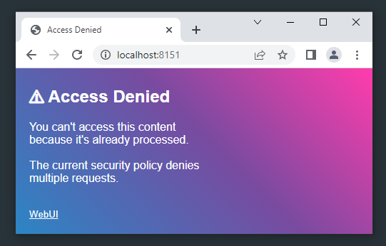

# WebUI v2.3.0 Go APIs

- [Build From Source](/c_api?id=build-from-source)
- [Examples](/go_api?id=examples)
- Window
    - [New Window](/go_api?id=new-window)
    - [Show Window](/go_api?id=show-window)
    - [Window status](/go_api?id=window-status)
- Binding & Events
    - [Bind](/go_api?id=bind)
    - [Events](/go_api?id=events)
- Application
    - [Wait](/go_api?id=wait)
    - [Exit](/go_api?id=exit)
    - [Close](/go_api?id=close)
    - [Startup Timeout](/go_api?id=startup-timeout)
    - [Multi Access](/go_api?id=multi-access)
- JavaScript
    - [Run JavaScript From Go](/go_api?id=run-javascript-from-go)
    - [Run Go From JavaScript](/go_api?id=run-go-from-javascript)
    - [TypeScript Runtimes](/go_api?id=typescript-runtimes)

---
### Build from Source

You can build WebUI Go wrapper from source by cloning the WebUI repo and compile it, tested with Go v1.20.3.

### Windows
```sh
git clone https://github.com/alifcommunity/webui.git
cd webui\examples\Go\hello_world
go clean
go build -o hello_world.exe
hello_world
```

### Linux
```sh
git clone https://github.com/alifcommunity/webui.git
cd webui/examples/Go/hello_world
go clean
go build -o hello_world
./hello_world
```

### macOS
```sh
git clone https://github.com/alifcommunity/webui.git
cd webui/examples/Go/hello_world
go clean
go build -o hello_world
./hello_world
```

To see the WebUI Go wrapper source code, please visit [WebUI](https://github.com/alifcommunity/webui/) in our GitHub repository.

---
### Examples

A minimal Go example

```go
import "github.com/alifcommunity/webui/webui"

var my_window = webui.NewWindow()
webui.Show(my_window, "<html>Hello World</html>")
webui.Wait()
```

Using a local HTML file. Please not that you need to add `<script src="/webui.js"></script>` to all your HTML files

```go
import "github.com/alifcommunity/webui/webui"

var my_window = webui.NewWindow()
webui.Show(my_window, "my_file.html")
webui.Wait()
```

Using a specific web browser

```go
import "github.com/alifcommunity/webui/webui"

var my_window = webui.NewWindow()
// Please add <script src="/webui.js"></script> to your HTML files
webui.ShowBrowser(my_window, "my_file.html", webui.Chrome)
webui.Wait()
```

Please visit [Go Examples](https://github.com/alifcommunity/webui/tree/main/examples/Go) in our GitHub repository for more complete examples.

---
### New Window

To create a new window object, you can use `webui.NewWindow()`, which returns a `Pointer` to the window object.

```go
var my_window = webui.NewWindow()
```

---
### Show Window

To show a window, you can use `show()`. If the window is already shown, the UI will get refreshed in the same window.

```go
// Show a window using the embedded HTML
webui.Show(my_window, "<html>Hello!</html>")
```

```go
// Show a window using an .html local file
// Please add <script src="/webui.js"></script> to your HTML files
webui.Show(my_window, "my_file.html")
```

Show a window using a specific web browser

```go
const my_html string = "<html>Hello!</html>"

// Google Chrome
webui.ShowBrowser(my_window, my_html, webui.Chrome)

// Mozilla Firefox
webui.ShowBrowser(my_window, my_html, webui.Firefox)

// Microsoft Edge
webui.ShowBrowser(my_window, my_html, webui.Edge)

// Microsoft Apple Safari (Not Ready)
webui.ShowBrowser(my_window, my_html, webui.Safari)

// The Chromium Project
webui.ShowBrowser(my_window, my_html, webui.Chromium)

// Opera Browser (Not Ready)
webui.ShowBrowser(my_window, my_html, webui.Opera)

// The Brave Browser
webui.ShowBrowser(my_window, my_html, webui.Brave)

// The Vivaldi Browser
webui.ShowBrowser(my_window, my_html, webui.Vivaldi)

// The Epic Browser
webui.ShowBrowser(my_window, my_html, webui.Epic)

// The Yandex Browser
webui.ShowBrowser(my_window, my_html, webui.Yandex)

// Default recommended web browser
webui.ShowBrowser(my_window, my_html, webui.AnyBrowser)

// Or simply
webui.Show(my_window, my_html)
```

If you need to update the whole UI content, you can also use the same function `show()`, which allows you to refresh the window UI with any new HTML content.

```go
const html string = "<html>Hello</html>"
const new_html string = "<html>New World!</html>"

// Open a window
webui.Show(my_window, html)

// Later...

// Refresh the same window with the new content
webui.Show(my_window, new_html)
```

---
### Window Status

To know if a specific window is running, you can use `IsShown()`.

```go
if webui.IsShown(my_window) {
    fmt.Printf("The window is still running")
} else {
    fmt.Printf("The window is closed.")
}
```

---
### Bind

Use `Bind()` to receive click events when the user clicks on any HTML element with a specific ID, for example `<button id="MyID">Hello</button>`.

```go
func my_function(e webui.Event) string {
	// <button id="MyID">Hello</button> gets clicked!
	return ""
}

webui.Bind(my_window, "MyID", my_function)
```

### Events

```go
func my_function(e webui.Event) string {
	fmt.Printf("Hi!, You clicked on element: %s\n", e.Element)
	return ""
}

// Empty ID means all events on all elements
webui.Bind(my_window, "", events)
```

The *e* corresponds to the word _Event_. `e` is a struct that has these elements:

```go
Window // Pointer: The window object
EventType // uint: Event type (EVENT_MOUSE_CLICK, EVENT_NAVIGATION...).
Element // string: HTML element ID.
Data // string: The data are coming from JavaScript, if any.
```

---
### Wait

It is essential to call `Wait()` at the end of your main function, after you create/shows all your windows. This will make your application run until the user closes all visible windows or when calling *[Exit()](/go_api?id=exit)*.

```go
// Create windows...
// Bind HTML elements...
// Show the windows...

// Wait until all windows get closed
// or when calling webui.Exit()
webui.Wait()
```

---
### Exit

At any moment, you can call `Exit()`, which tries to close all related opened windows and make *[Wait](/go_api?id=wait)* break.

```go
webui.Exit()
```

---
### Close

You can call `Close()` to close a specific window, if there is no running window left *[Wait](/go_api?id=wait)* will break.

```go
webui.Close(my_window)
```

---
### Startup Timeout

WebUI waits a couple of seconds (_Default is 30 seconds_) to let the web browser start and connect. You can control this behavior by using `SetTimeout()`.

```go
// Wait 10 seconds for the browser to start
webui.SetTimeout(10)

// Now, After 10 seconds, if the browser did
// not get started, Wait() will break
webui.Wait()
```

```go
// Wait forever.
webui.SetTimeout(0)

// Wait() will never end
webui.Wait()
```

---
### Multi Access



After the window is loaded, the URL is not valid anymore for safety. WebUI will show an error if someone else tries to access the URL. To allow multi-user access to the same URL, you can use `SetMultiAccess()`.

```go
webui.SetMultiAccess(my_window, true)
```

---
### Run JavaScript From Go

You can run JavaScript on any window to read values, update the view, or anything else. In addition, you can check if the script execution has errors, as well as receive data.

```go
// Create new JavaScript object
js := webui.NewJavaScript()

// Run the script
if !webui.Script(e.Window, &js, "return 2*2;") {
    // Error
    fmt.Printf("JavaScript Error: %s\n", js.Response)
}

// Print the Response
fmt.Printf("JavaScript Response: %s\n", js.Response)

// Run JavaScript quickly with no waiting for the response
webui.Run(e.Window, "alert('Fast!')")
```

---
### Run Go From JavaScript

To call a Go function from JavaScript and get the result back please use `webui_fn('MyID', 'My Data').then((response) => { ... });`. If the function does not have a response then it's safe to remove the `then` method like this `webui_fn('MyID_NoResponse', 'My Data');`.

```go
func my_function(e webui.Event) string {
	
    // Get data from JavaScript
    fmt.Printf("Data from JavaScript: %s\n", e.Data) // Message from JS

    // Return back a response to JavaScript
    return "Message from Go"
}

webui.Bind(my_window, "MyID", my_function)
```

JavsScript:

```js
webui_fn('MyID', 'Message from JS').then((response) => {
    console.log(response); // "Message from Go
});
```

---
### TypeScript Runtimes

You may want to interpret JavaScript & TypeScript files and show the output in the UI. You can use `SetRuntime()` and choose between `Deno` or `Nodejs` as your runtimes.

```go
// Deno
webui.SetRuntime(my_window, webui.Deno)
webui.Show(my_window, "my_file.ts")

// Nodejs
webui.SetRuntime(my_window, webui.Nodejs)
webui.Show(my_window, "my_file.js")
```
